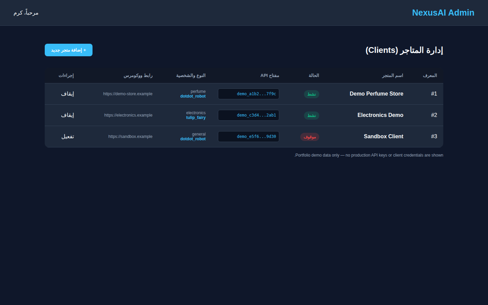
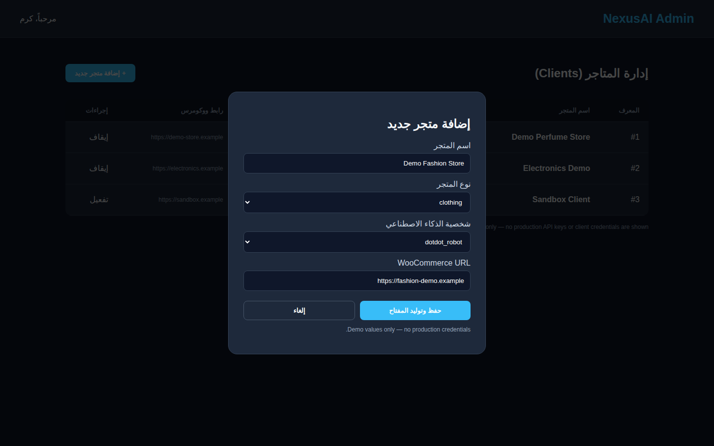
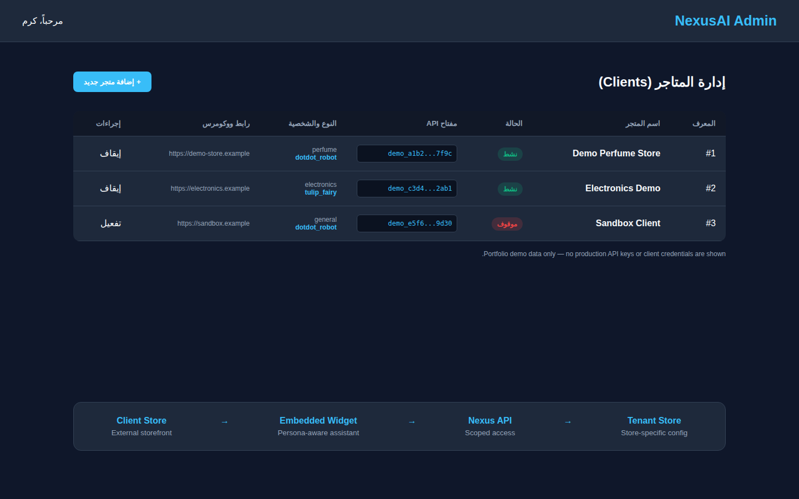
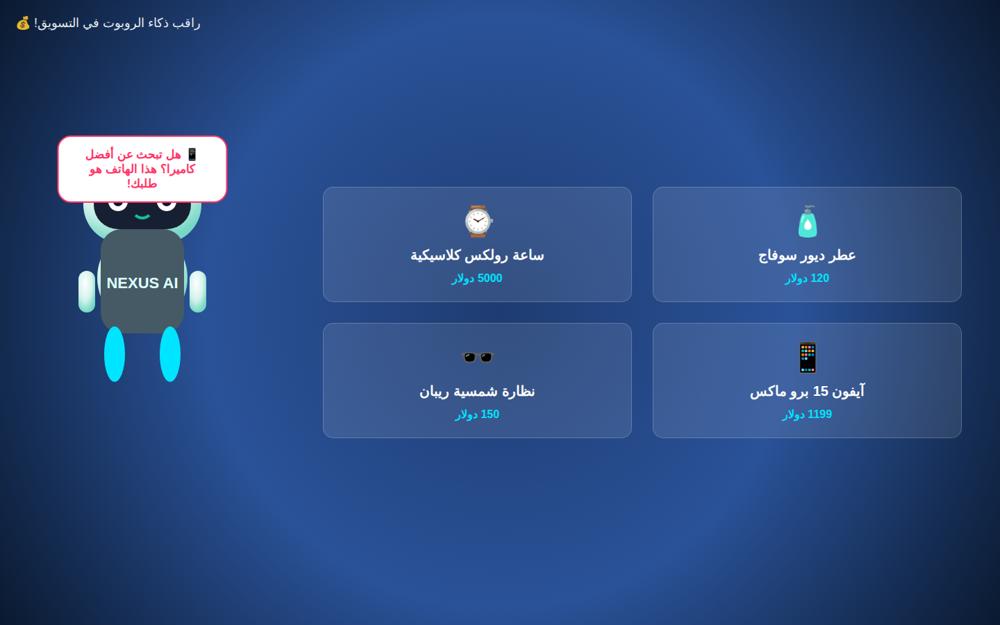
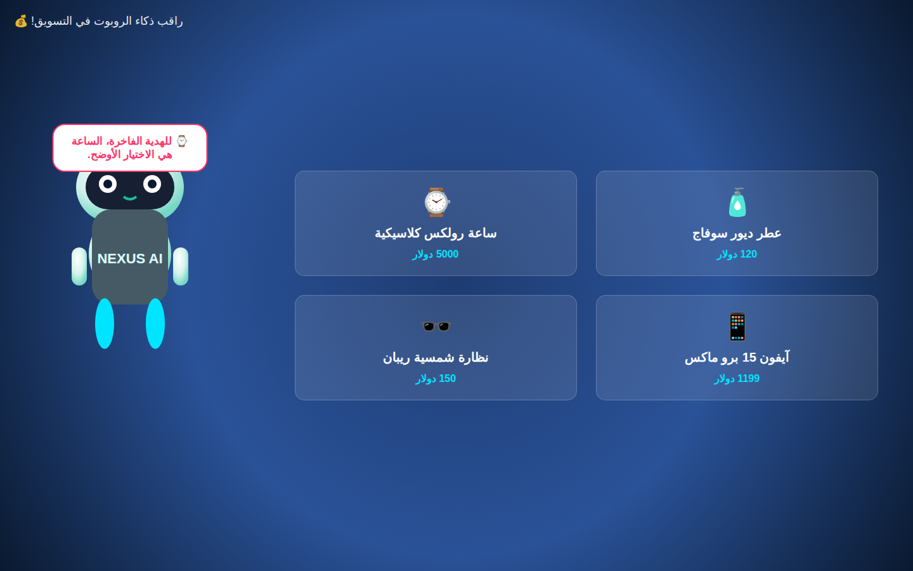
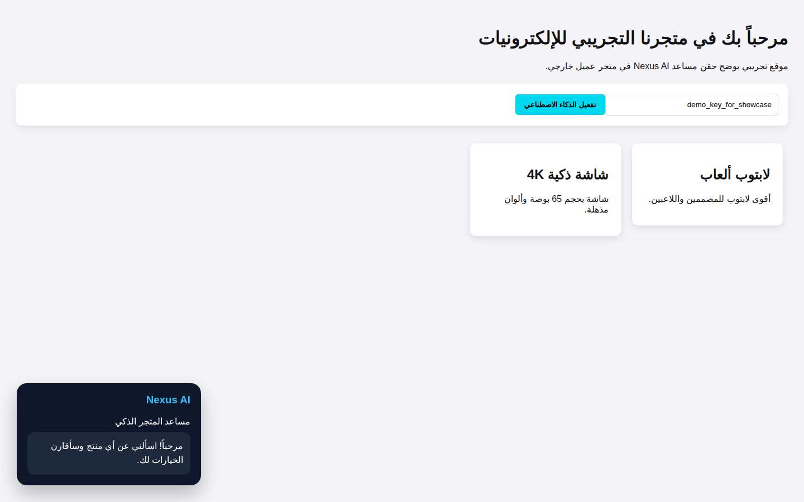
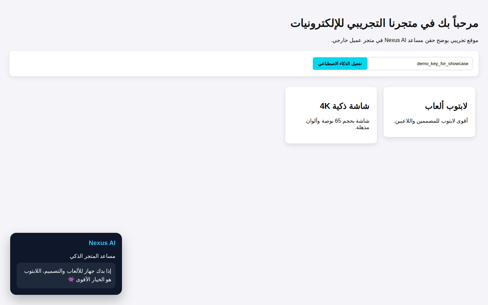
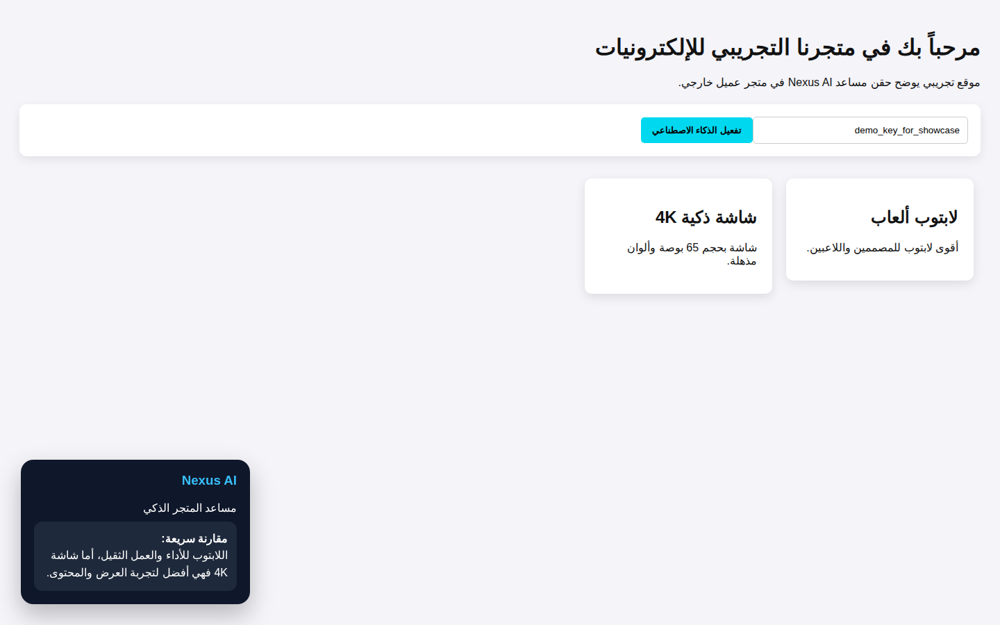

# Nexus AI

> Private AI-enabled SaaS backend and e-commerce assistant platform.

## Product Preview

The public showcase uses **sanitized portfolio previews based on the project's real UI structure and workflows**. All stores, URLs, API values, and product data shown below are demonstration-only.

### Multi-tenant Admin Dashboard
The admin experience represents connected client stores, activation state, store type, AI persona, WooCommerce endpoint, and scoped API access.



<p align="center">
  
  
</p>

The additional views show the sanitized tenant onboarding flow and a portfolio-safe representation of how store configuration connects to the embedded assistant and central API.

### AI Commerce Robot
The project includes an interactive robot persona designed to react to product context and present targeted commerce prompts inside an e-commerce experience.



<p align="center">
  
  
</p>

These previews demonstrate the same commerce-assistant concept reacting to different product contexts rather than presenting a single static marketing screen.

### Client Store Integration
A separate demo storefront illustrates the client-side integration model: an external store activates Nexus AI and receives an embedded commerce-support experience.



<p align="center">
  
  
</p>

The three client-side states represent assistant activation, contextual recommendation, and lightweight product comparison.

> **Privacy note:** No real WooCommerce credentials, client secrets, production API keys, customer records, private infrastructure addresses, or production database data are published in these previews.

## Overview
Nexus AI explores a centralized AI service for multiple e-commerce clients. Each connected store can be represented as an independent tenant with its own configuration, store type, AI persona, API access, and commerce integration.

## Engineering Areas
- FastAPI-based central backend
- Multi-tenant store configuration
- SQLAlchemy persistence with local SQLite fallback and PostgreSQL-ready configuration
- Store-specific API-key access
- Dynamic AI persona selection
- WooCommerce-oriented integration layer
- Embeddable client-side AI widget architecture
- Rate-limited chat API and origin-aware request handling
- Admin and demonstration interfaces

## Tech Stack
`Python` · `FastAPI` · `SQLAlchemy` · `SQLite / PostgreSQL` · `Jinja2` · `JavaScript` · `Google GenAI` · `WooCommerce`

## Architecture Snapshot

```text
Client Store
    │
    ├── Embedded Nexus AI Widget
    │        │
    │        ▼
    └── Nexus AI Central API
             │
             ├── Tenant / Store Configuration
             ├── AI Persona & Session Logic
             ├── Commerce Integration Layer
             └── Persistent Store Data
```

This diagram intentionally stays at a portfolio-safe level and does not expose private infrastructure, secrets, internal deployment configuration, or proprietary implementation details.

## Project Status
**Active development · Private source · Portfolio showcase**

The working source repository remains private and protected.

## Source Policy
**Portfolio showcase only. Source code, credentials, production infrastructure details, proprietary logic, private integrations, and security-sensitive implementation details are intentionally not published.**

## Preview Reproducibility
The public showcase includes a small sanitized preview generator and GitHub Actions workflow used only to regenerate the portfolio screenshots. It contains demonstration UI data and does not mirror the private application source.

## Rights
© Karam Alawaj. All rights reserved. No license is granted to copy, redistribute, reuse, or republish proprietary source or implementation details.
