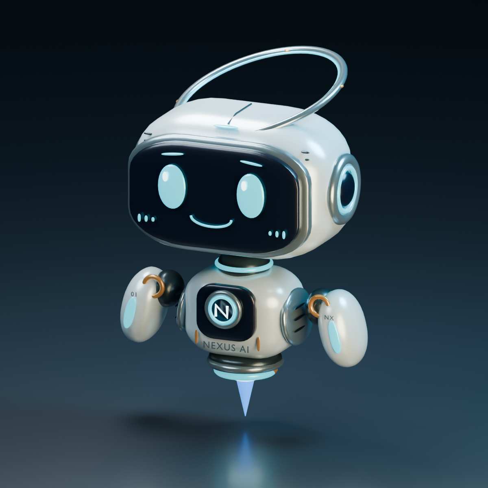
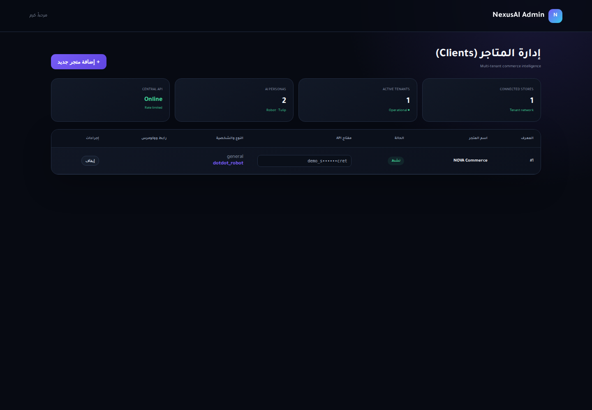
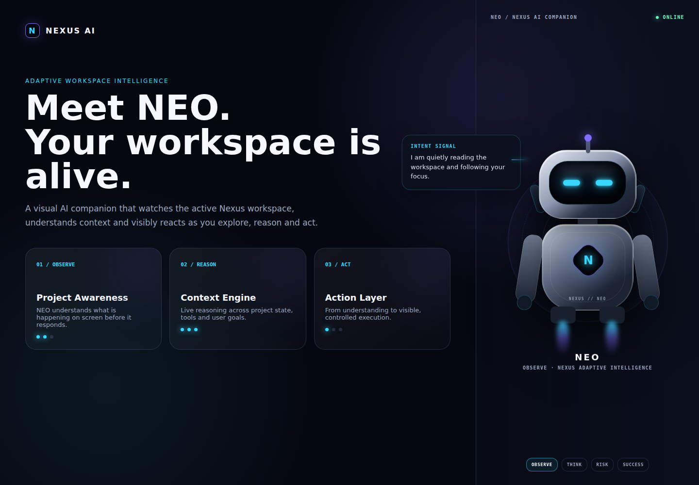
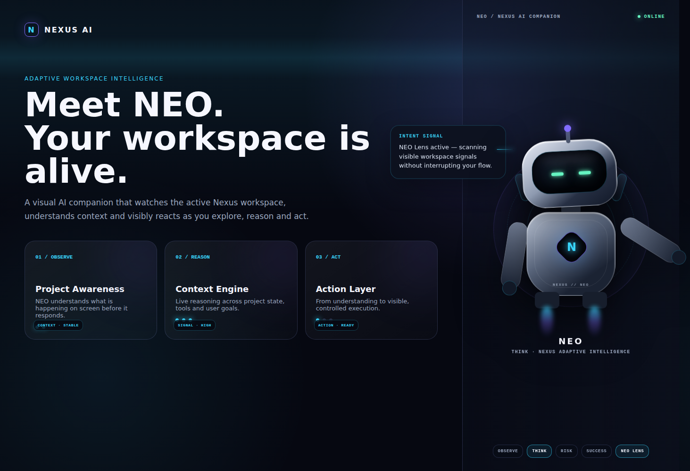
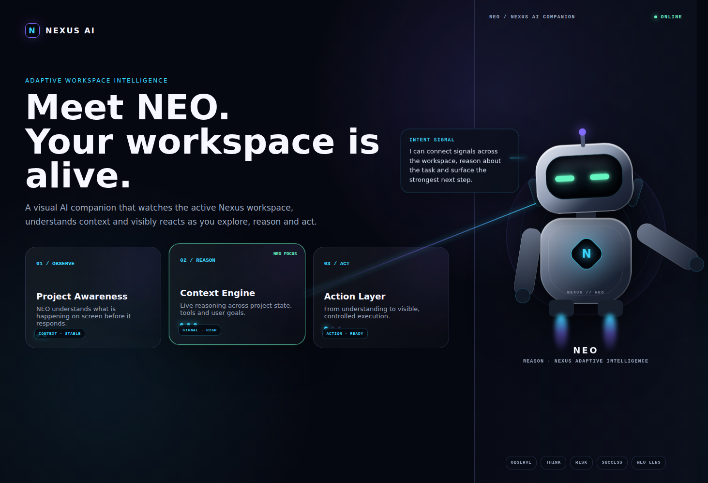
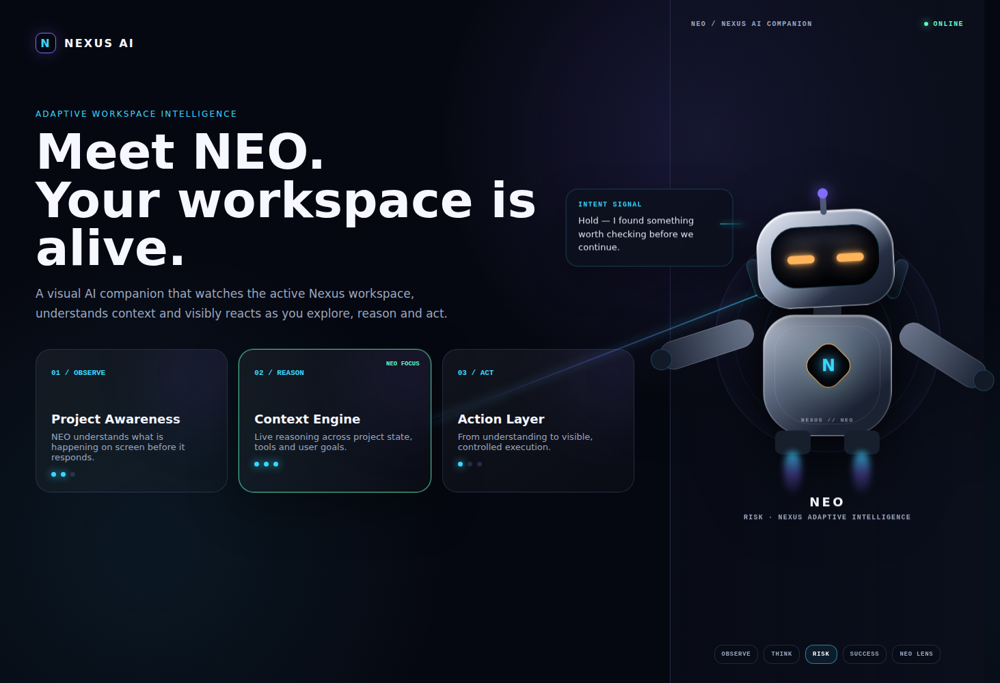
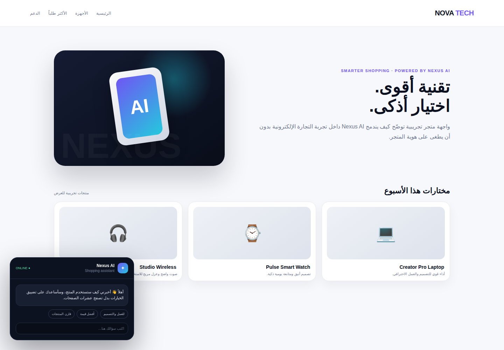

# [Nexus AI](https://github.com/Karamalawaj/nexus-ai-showcase)

> AI-powered multi-tenant commerce assistant built around a central FastAPI service, store-aware AI personas and WooCommerce-oriented integration.

## NEO · Interactive 3D Companion

[**Launch the interactive NEO experience →**](https://karamalawaj.github.io/nexus-ai-showcase/)

An original modular robot concept for Nexus AI, modelled in Blender and brought to life in a self-contained Three.js experience. NEO has a ceramic and titanium shell, cyan optical details, an orbital stabilizer and an animated ion thruster.

- More than 20 motion and expression states: hover, greeting, flight, joy, thinking, wink, curiosity, mechanical sneeze, look-around, stretch, nod, head shake, bow, scan, peek, dance, surprise, sleepiness, orbit, shyness and conversation transformation.
- Independent head and eye attention follows the pointer. An optional autonomous personality adds occasional gestures; reduced-motion controls remain available.
- The body separates around a conversation card while the eyes remain above it. Typing and thinking affect the expression; the close button, Escape and End conversation reassemble NEO.
- Time-based transitions stop exactly at their endpoints and blend smoothly between gestures.

**This is an interactive visual design prototype with illustrative local replies. It is not connected to the private Nexus AI backend or live store data.** The public page contains only this demonstration's browser assets; the commerce platform source, credentials and customer data remain private.

[](https://karamalawaj.github.io/nexus-ai-showcase/)

## Real Application Preview

The screenshots below are captured from the **actual running Nexus AI application**. The source repository remains private; the portfolio publishes only safe visual output with demonstration data.

### 01 · Multi-tenant Control Center



The control center manages connected stores, activation state, store type, AI persona and scoped access while keeping commerce credentials out of the public portfolio.

### 02 · NEO — Nexus AI Companion



NEO is evolving beyond a conventional chat surface into a visual AI companion that can observe workspace context, change behavior and communicate through motion as well as text.

### 03 · NEO Interaction System

NEO now has a visible interaction layer rather than a single static assistant state. These captures are produced after Playwright interacts with the real running Nexus AI application.

#### NEO Lens · Workspace Scan



**NEO Lens** switches the companion into an active analysis state. The workspace receives a live scan treatment and NEO exposes contextual signals such as stability, signal strength and action readiness without forcing the user into a chat window.

#### NEO Focus · Contextual Attention



**NEO Focus** lets the user select a workspace surface directly. NEO changes state, physically reacts toward the selected panel and creates a visual connection to the context it is reasoning about.

#### NEO Risk · Intervention State



**Risk mode** gives NEO a distinct intervention behavior for moments that deserve attention before an action continues. Its posture, eye/core treatment and message change together.

#### Interaction model

`Observe → Focus → Think → Act → Risk / Success`

The engine also supports persistent panel selection, pointer-aware eye movement, state-specific body reactions, keyboard selection and reduced-motion behavior.

### 04 · Embedded Store Experience



The client storefront demonstrates how Nexus AI appears inside a commerce experience while the central service remains responsible for tenant configuration and assistant behavior.

> **Capture policy:** These images come from Nexus AI running through FastAPI and rendered in a real browser session. They are not separately designed HTML mockups. Demonstration store data is used so no production customer information or secrets are published.

## Overview

Nexus AI explores a centralized AI service for multiple e-commerce clients. Each connected store is an independent tenant with its own configuration, store type, AI persona, API access and commerce integration.

## What the system demonstrates

- Central FastAPI service coordinating multiple client stores
- Tenant-isolated chat sessions and bounded in-memory session handling
- SQLAlchemy persistence with SQLite fallback and PostgreSQL-ready configuration
- Store-specific API-key access with sanitized admin presentation
- Dynamic AI persona selection and NEO commerce persona
- WooCommerce-oriented product retrieval
- Embeddable client-side AI widget architecture
- Rate-limited chat API and origin-aware requests
- Product-grounded assistant behavior with bounded conversation memory
- Automated real-application visual acceptance through Playwright

## Tech Stack

`Python` · `FastAPI` · `SQLAlchemy` · `SQLite / PostgreSQL` · `Jinja2` · `JavaScript` · `Google GenAI` · `WooCommerce` · `Playwright`

## Architecture Snapshot

```text
Client Store
    │
    ├── Embedded Nexus AI / NEO
    │        │
    │        ▼
    └── Nexus AI Central API
             │
             ├── Tenant / Store Configuration
             ├── AI Persona & Session Logic
             ├── Commerce Integration Layer
             └── Persistent Store Data
```

## Project Status

**Active development · Private source · Public portfolio showcase**

The working source repository remains private and protected. The public repository intentionally contains portfolio-safe evidence rather than proprietary implementation code.

## Source Policy

**Portfolio showcase only. Source code, credentials, production infrastructure details, proprietary logic, private integrations and security-sensitive implementation details are intentionally not published.**

## Rights

© Karam Alawaj. All rights reserved. No license is granted to copy, redistribute, reuse or republish proprietary source or implementation details.
