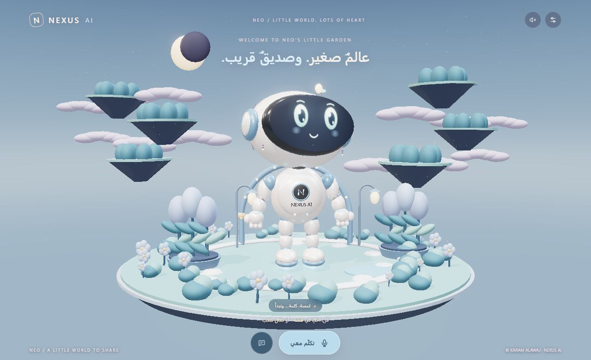

# [Nexus AI](https://github.com/Karamalawaj/nexus-ai-showcase)

> AI-powered multi-tenant commerce assistant built around a central FastAPI service, store-aware AI personas and WooCommerce-oriented integration.

## NEO · Interactive 3D Companion

[**Launch the interactive NEO experience →**](https://karamalawaj.github.io/nexus-ai-showcase/)

NEO Bloom is a soft ceramic companion with a rounded face, expressive eyes, blue trim by default, an optional rose palette and a little floating garden. The original Blender model has 36 articulated joints. The garden includes flowers, a pond, lanterns, clouds and distant islands, with batched geometry and instanced flowers for smoother rendering.

- Live game awareness: NEO follows the next star, falling seeds and approaching gates, reacts to actual successes and setbacks, and offers brief contextual voice encouragement when sound is enabled. Damped joint springs add inertia and limit elbows, knees and ankles.
- Thirty contextual gestures and performances, pointer/touch reactions, smooth chat transformation and a responsive mobile layout.
- Three redesigned games with cohesive pastel graphics, progress, clear outcomes and saved local records: **Garden of Wishes** grows flowers from twenty collected seeds; **Star Painter** reveals three constellation drawings; **Cloud Mail** delivers twelve letters through golden gates.
- Native streaming conversation with a gentle voice by default and a second warm voice in settings. Speech drives the face. Stories and short original vocal performances depend on the voice model; singing quality is not guaranteed.
- Microphone input begins on an explicit tap and stops when disconnected, when closing chat or when hiding the page. Voice requires permission and a supported secure browser. Each demo voice connection lasts up to three minutes.
- Validated AI tools choose movement, lighting and games. Reduced-motion controls preserve essential game input, and rendering resolution adapts to sustained slow frames.

**Connected to the real NEXUS AI conversation service.** This portfolio experience does not expose live store data. Authoring files, backend logic and API credentials stay in a private repository. The public page serves the compiled assets necessary to run the browser experience.

[](https://karamalawaj.github.io/nexus-ai-showcase/)

## Real Application Preview

The screenshots below are captured from the **actual running Nexus AI application**. The source repository remains private; the portfolio publishes only safe visual output with demonstration data.

### 01 · Multi-tenant Control Center


The control center manages connected stores, activation state, store type, AI persona and scoped access while keeping commerce credentials out of the public portfolio.

### 02 · NEO — Nexus AI Companion


NEO is evolving beyond a conventional chat surface into a visual AI companion that can observe workspace context, change behavior and communicate through motion as well as text.

### 03 · NEO Interaction System

NEO now has a visible interaction layer rather than a single static assistant state. These captures are produced after Playwright interacts with the real running Nexus AI application.

#### NEO Lens · Workspace Scan


**NEO Lens** switches the companion into an active analysis state. The workspace receives a live scan treatment and NEO exposes contextual signals such as stability, signal strength and action readiness without forcing the user into a chat window.

#### NEO Focus · Contextual Attention


**NEO Focus** lets the user select a workspace surface directly. NEO changes state, physically reacts toward the selected panel and creates a visual connection to the context it is reasoning about.

#### NEO Risk · Intervention State


**Risk mode** gives NEO a distinct intervention behavior for moments that deserve attention before an action continues. Its posture, eye/core treatment and message change together.

#### Interaction model

`Observe → Focus → Think → Act → Risk / Success`

The engine also supports persistent panel selection, pointer-aware eye movement, state-specific body reactions, keyboard selection and reduced-motion behavior.

### 04 · Embedded Store Experience


The client storefront demonstrates how Nexus AI appears inside a commerce experience while the central service remains responsible for tenant configuration and assistant behavior.

> **Capture policy:** These images come from Nexus AI running through FastAPI and rendered in a real browser session. They are not separately designed HTML mockups. Demonstration store data is used so no production customer information or secrets are published.

## Overview

Nexus AI explores a centralized AI service for multiple e-commerce clients. Each connected store is an independent tenant with its own configuration, store type, AI persona, API access and commerce integration.

## What the system demonstrates

- Central FastAPI service coordinating multiple client stores
- Tenant-isolated chat sessions and bounded in-memory session handling
- SQLAlchemy persistence with SQLite fallback and PostgreSQL-ready configuration
- Store-specific API-key access with sanitized admin presentation
- Dynamic AI persona selection and NEO commerce persona
- WooCommerce-oriented product retrieval
- Embeddable client-side AI widget architecture
- Rate-limited chat API and origin-aware requests
- Product-grounded assistant behavior with bounded conversation memory
- Automated real-application visual acceptance through Playwright

## Tech Stack

`Python` · `FastAPI` · `SQLAlchemy` · `SQLite / PostgreSQL` · `Jinja2` · `JavaScript` · `Google GenAI` · `WooCommerce` · `Playwright`

## Architecture Snapshot

```text
Client Store
    │
    ├── Embedded Nexus AI / NEO
    │        │
    │        ▼
    └── Nexus AI Central API
             │
             ├── Tenant / Store Configuration
             ├── AI Persona & Session Logic
             ├── Commerce Integration Layer
             └── Persistent Store Data
```

## Project Status

**Active development · Private source · Public portfolio showcase**

The working source repository remains private and protected. The public repository intentionally contains portfolio-safe evidence rather than proprietary implementation code.

## Source Policy

**Portfolio showcase only.** Backend source, credentials, private integrations and authoring files are not published. The live demo necessarily delivers compiled JavaScript and 3D assets to the browser; minification and omitted source maps do not make those assets impossible to inspect or copy. Copyright restrictions apply to the proprietary artwork and implementation. Third-party license notices are retained.

## Rights

© Karam Alawaj. All rights reserved. No license is granted to copy, redistribute, reuse or republish proprietary source or implementation details.
